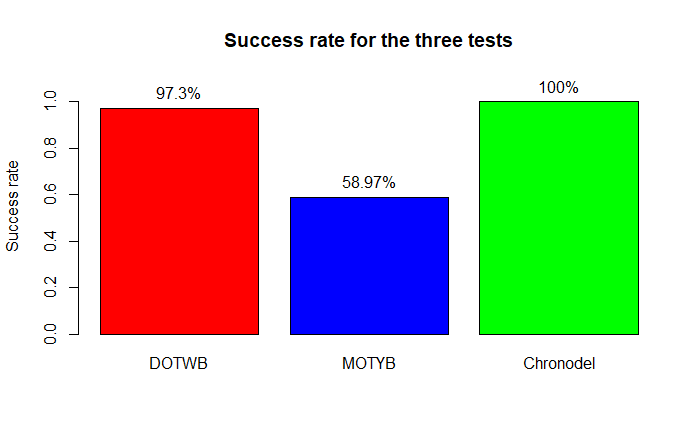
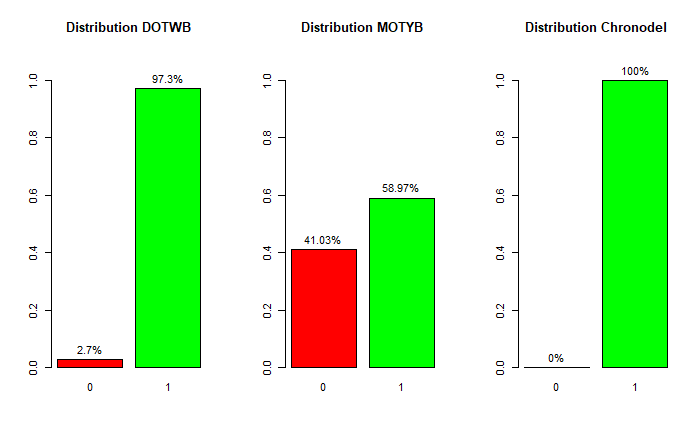

# 1. Chronodel Data Analysis

## Key findings

- Chronodel **strongly suggests a ceiling effect** (100% success)
- DOTWB **suggests a ceiling effect** (97.3% success)
- MOTYB shows a **more balanced distribution** (~59% success)
- Low agreement between tests (**κ ≈ 0 across comparisons**)

## 1.1. Delirium

Delirium is an acute clinical syndrome (ACS) that typically develops in older adults. It is characterized by disturbances in attention, awareness, and cognition, with a reduced ability to focus, sustain, or shift attention. It develops over a short period of time and tends to fluctuate throughout the day. The clinical presentation may vary, often including psychomotor and behavioral disturbances such as hyperactivity or hypoactivity, as well as alterations in sleep duration and architecture.(1)

The clinical features are defined by the DSM-5 as follows: a disturbance in attention (Criterion A); a rapid onset of symptoms (Criterion B); symptoms associated with an additional cognitive disturbance (Criterion C). These symptoms must not be better explained by a pre-existing neurocognitive disorder (NCD) or by a severely reduced level of arousal such as coma (Criterion D). There must also be evidence from the medical history, physical examination, or additional investigations supporting a direct medical cause, substance intoxication, medication use, or withdrawal (Criterion E).(2)

## 1.2. Chronodel presentation

The aim of this study is to analyze data from the **Chronodel test**, which assesses the ability to perform a task within **30 seconds—specifically**, counting from 0 to 30 in the correct order, without repetition and without skipping any numbers. The dataset includes a sample of participants (**n = 43**).

The study was **initially** designed to assess the diagnostic performance of the *Chronodel test*, including sensitivity, specificity, positive predictive value (PPV), and negative predictive value (NPV), and to compare its performance with two other tests assessing similar cognitive functions: *Day Of The Week Backward* (*DOTWB*) and *Month Of The Year Backward* (*MOTYB*). (3)

As the study is still ongoing, a **preliminary analysis** of the available data was conducted to **explore** the distribution of results and the level of agreement between the three tests.

## 1.3. Methodological Adjustment: Change in Primary Objective

However, due to a **low variability** in the results — with most participants scoring 1 (indicating success) — the initially planned diagnostic performance analyses were not appropriate.

Therefore, the analysis plan was revised to focus on:

- **the percentage of success** for each test (*DOTWB*, *MOTYB*, *Chronodel*)
- **the concordance** between tests
- **the distribution** of results to assess variability and potential ceiling effects

As these were limited and not overlapping across variables, analyses were conducted using available data, resulting in partially overlapping samples across analyses.

# 2. Python Project

## 2.1 Role of Python

Python was used for:
- Data cleaning
- Selection of relevant variables
- Preliminary descriptive analysis

## 2.2. Data preparation

The dataset was first loaded and preprocessed. Subjects who did not meet the study’s inclusion criteria were excluded from the analysis.

Preliminary descriptive analyses were performed to assess the distribution of the variables and the corresponding success rates, including graphical visualizations.

The dataset was then restricted to the variables relevant to the study objectives.

The following outcome variables were retained:

- `jour_reussite` (DOTWB)
- `mois_reussi` (MOTYB)
- `chrono_reussi` (Chronodel)

## 2.3 Script organization

### 2.3.1 Data processing pipeline

#### 2.3.1.1 Data import verification

- **Aim**: Verify the presence of the dataset in the project directory.
- **Input**: Raw dataset file (Data/ChronodelSansTNC_DATA_2026-03-30_1433.csv) from `Data` folder
- **Output**: Confirmation of file availability
 
#### 2.3.1.2 Application of inclusion criteria

- **Aim**: Exclude subjects not meeting the study inclusion criteria.
- **Input**: Raw dataset (Data)
- **Output**: Filtered dataset containing eligible subjects only

#### 2.3.1.3 Descriptive analysis and data cleaning

- **Aim**: Compute success rates and generate descriptive statistics.
- **Input**: Cleaned dataset
- **Output**:
    - Success rate table (data_graph.csv) into `Results` folder
    - Figure (Success_rate_Rstudio.png) into `Figures` folder
    - Final analysis dataset (Stat_Chronodel_Rstudio_test.csv) into `Results` folder

# 3. RStudio Project

## 3.1 Role of Rstudio

R was used for:
- statistical analysis (Cohen’s kappa)
- graphical representations
- final interpretation of results

A small number of missing values were observed. As these were limited and not overlapping across variables, analyses were conducted using available data.

# 3.1.1 Data organization

**The file** "Stat_Chronodel_Rstudio_test.csv" contains the cleaned dataset with the following variables:
- *jour_reussite* (DOTWB): binary variable indicating success (1) or failure (0) on the Day Of The Week Backward test
- *mois_reussi* (MOTYB): binary variable indicating success (1) or failure (0) on the Month Of The Year Backward test
- *chrono_reussi* : binary variable indicating success (1) or failure (0) on the Chronodel test

# 3.1.2 Script organization

## 3.1.2.1 Cohen's kappa

- **aim**: assess the level of agreement between the three tests using Cohen’s kappa coefficient.
- **Input**: cleaned dataset stored in the `Data` folder.
- **output**: Cohen’s kappa coefficients and p-values for each pairwise comparison between the three tests.

## 3.1.2.2 cross table

- **aim**: perform a cross-tabulation of results between *DOTWB* and *MOTYB* to assess concordance and discordance rates.
- **Input**: cleaned dataset stored in the `Data` folder.
- **output**: a cross-tabulation table showing the counts of success and failure for *DOTWB* and *MOTYB*, along with calculated concordance and discordance rates saved as (cross_tab_dotwb_motyb.csv) in the `Rstudio/Results` folder.

## 3.1.2.3 success rate
- **aim**: to calculate the percentage of success for each test and to visualize these rates using a bar plot.
- **Input**: cleaned dataset stored in the `Data` folder.
- **output**: a bar plot showing the success rates for *DOTWB*, *MOTYB*, and *Chronodel* called "Success rate for the three tests" and saved as (Success_rate_Rstudio.png)in the `Results` folder.

## 3.1.2.4 distribution 

- **aim**: to visualize the distribution of results for each test to assess variability and potential ceiling effects.
- **Input**: cleaned dataset stored in the `Data` folder.
- **output**: three bar plots showing the distribution of results for *DOTWB*, *MOTYB*, and *Chronodel* called "Distribution DOTWB", "Distribution MOTYB", and "Distribution Chronodel" respectively, and saved as (Distribution_Rstudio.png) in the `Results` folder.

# 4. Data processing

**This section presents the statistical analyses conducted in R to assess agreement and distribution patterns between tests.**

Data cleaning was carried out prior to analysis using Visual Studio Code. The cleaned dataset was then imported into RStudio for 
statistical analysis from the file "Stat_Chronodel_Rstudio_test.csv".

## 4.1 Cohen's kappa

**Cohen’s kappa analyses** were conducted using pairwise complete-case datasets for each comparison. **As a result**, the effective sample size **varied** depending on the availability of **both variables** involved in each pair.

**Cohen’s kappa** was used as the **primary measure of agreement**, despite known limitations in the presence of highly unbalanced outcome distributions including the so-called paradox of Cohen’s kappa.

Alternative agreement coefficients less sensitive to prevalence (e.g., **Gwet’s AC1**) have been proposed in the literature, but were not implemented in the present analysis due to **software constraints** and **the exploratory nature** of the study.(5)

The **very low kappa values (κ ≈ 0 across comparisons**) should be interpreted in the context of the **outcome distributions**. This lack of variability **limits** the ability of agreement statistics to detect concordance beyond chance. These aspects are further explored in the descriptive analyses.

## 4.2 Cross table

The cross-tabulation between *DOTWB* and *MOTYB* is available in the `Results` folder:

- `Results/cross_tab_dotwb_motyb.csv`

|   | 0 | 1 |
|---|---|---|
| 0 | 1 | 0 |
| 1 | 13 | 22 |

The cross-tabulation confirms a relatively low concordance between *DOTWB* and *MOTYB*, with a discordance of (13/36 pairs) corresponding to 36.1%, consistent with the low agreement observed using Cohen’s kappa.

## 4.3 Success rate

The success rates of the three tests were analysed to assess their **coherence** and **potential** ceiling effects.

The Chronodel test shows a **perfect success rate (100%)**, which may indicate a potential ceiling effect.

## 4.4 Distribution 

The final figure presents the distribution of results across the three tests, in order to assess **variability** and **potential** ceiling effects.

The Chronodel test shows a **highly skewed distribution**, with 100% of successful outcomes, **suggesting** a ceiling effect.

Ceiling effects may **limit** the **interpretability** of test scores when a task is too easy, leading to an accumulation of maximal scores and **reduced discriminative capacity** (4)

# 5. Conclusion

The analysis of Chronodel data in the context of delirium reveals:

- The *Chronodel* test strongly suggests a ceiling effect.
- The *DOTWB* test suggests a ceiling effect.
- The *MOTYB* test shows a more balanced distribution.

**This interpretation is descriptive and based on outcome distributions rather than on a formal statistical test of ceiling effects. Missing values were limited and did not overlap across variables; therefore, complete-case analyses were performed.**

# 6. References

1. Andorra, Boris, Alexandre Boussuge, Thomas Gilbert, et al. ‘Le Repérage et Le Diagnostic de l’état Confusionnel Aigu Chez Les Personnes Âgées : Quels Outils Rapides ?’ Gériatrie et Psychologie Neuropsychiatrie Du Vieillissement 20, no. 1 (2022): 17–27. https://doi.org/10.1684/pnv.2022.1022.
2. Garnier-Crussard, Antoine, Clémence Grangé, Jean-Michel Dorey, and Guillaume Chapelet. ‘Diagnostic et Prise En Soins Du Syndrome Confusionnel Aigu Chez La Personne Âgée’. La Revue de Médecine Interne 46, no. 5 (2025): 265–75. https://doi.org/10.1016/j.revmed.2024.11.005.
3. Ramírez Echeverría, María de Lourdes, and Caroline Schoo. ‘Delirium’. In StatPearls. StatPearls Publishing, 2026. http://www.ncbi.nlm.nih.gov/books/NBK470399/.
4. Rasmussen, L. S., K. Larsen, P. Houx, et al. ‘The Assessment of Postoperative Cognitive Function’. Acta Anaesthesiologica Scandinavica 45, no. 3 (2001): 275–89. https://doi.org/10.1034/j.1399-6576.2001.045003275.x.
5. Zec, Slavica, Nicola Soriani, Rosanna Comoretto, and Ileana Baldi. ‘High Agreement and High Prevalence: The Paradox of Cohen’s Kappa’. The Open Nursing Journal 11 (October 2017): 211–18. https://doi.org/10.2174/1874434601711010211.

**ChatGPT (OpenAI) was used for language editing and clarification. The author remains fully responsible for the content.**