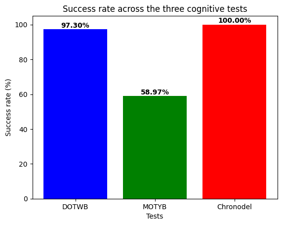

# 1. Stat Chronodel Rstudio VSC

## Key findings

- Chronodel shows a **potential ceiling effect (100% success)**
- DOTWB also suggests a **ceiling effect (97.3%)**
- MOTYB presents a **balanced distribution (~59%)**
- Low agreement between tests (**κ ≈ 0**)

## 1.1. Delirium

Delirium is an acute clinical syndrome (ACS) that typically develops in older adults. It is characterized by disturbances in attention, awareness, and cognition, with a reduced ability to focus, sustain, or shift attention. It develops over a short period of time and tends to fluctuate throughout the day. The clinical presentation may vary, often including psychomotor and behavioral disturbances such as hyperactivity or hypoactivity, as well as alterations in sleep duration and architecture.(3)

The clinical features are defined by the DSM-5 as follows: a disturbance in attention (Criterion A); a rapid onset of symptoms (Criterion B); symptoms associated with an additional cognitive disturbance (Criterion C). These symptoms must not be better explained by a pre-existing neurocognitive disorder (NCD) or by a severely reduced level of arousal such as coma (Criterion D). There must also be evidence from the medical history, physical examination, or additional investigations supporting a direct medical cause, substance intoxication, medication use, or withdrawal (Criterion E).(2)

## 1.2. Chronodel presentation

The aim of this study is to analyze data from the Chronodel test, which assesses the ability to perform a task within 30 seconds—specifically, counting from 0 to 30 in the correct order, without repetition and without skipping any numbers. The dataset includes a sample of participants (n = 43).

The objectives were to evaluate the Chronodel test, describe the distribution of results, and compare its performance with two other tests assessing similar cognitive functions: Day Of The Week Backward *DOTWB* and Month Of The Year Backward *MOTYB*. (1)

## 1.3. Methodological Adjustment: Change in Primary Objective

**Initially**, sensitivity, specificity, positive predictive value, and negative predictive value were planned for the Chronodel test. **However**, due to a **low variability** in the results — with most participants scoring 1 (indicating success) — this analysis **was not appropriate**.

Therefore, the analysis plan was revised to focus on :

- **the percentage of success** for each test (*DOTWB*, *MOTYB*, *Chronodel*)
- **the concordance** between tests
- **the distribution** of results to assess variability and potential ceiling effects

# 2. Python Project

## 2.1 Role of Python

Python was used for:
- Data cleaning
- Selection of relevant variables
- Preliminary descriptive analysis

## 2.2. Data preparation

The dataset was first loaded and preprocessed. Subjects who did not meet the study’s inclusion criteria were excluded from the analysis.

Preliminary descriptive analyses were performed to assess the distribution of the variables and the corresponding success rates, including graphical visualizations.

The dataset was then restricted to the variables relevant to the study objectives.

The following outcome variables were retained:

- `jour_reussite` (DOTWB)
- `mois_reussi` (MOTYB)
- `chrono_reussi` (Chronodel)

# 3. RStudio Project

R was used for:
- Statistical analysis (Cohen’s kappa)
- Graphical representations
- Final interpretation of results

A small number of missing values were observed. As these were limited and not overlapping across variables, analyses were conducted using available data.

# 4. Data inclusion

Data cleaning was carried out prior to analysis using Visual Studio Code. The cleaned dataset was then imported into RStudio for statistical analysis from the file "Stat_Chronodel_Rstudio_test.csv".

# 5. Data processing

## 5.1. Cohen's kappa

**Cohen’s kappa analyses** were conducted separately for each pairwise comparison using the corresponding complete-case dataset. The number of available observations varied across comparisons due to missing data patterns.

**Cohen’s kappa** was used as the **primary measure of agreement**, despite known limitations in the presence of highly unbalanced outcome distributions.

Alternative agreement coefficients less sensitive to prevalence (e.g., **Gwet’s AC1**) have been proposed in the literature, but were not implemented in the present analysis due to **software constraints** and **the exploratory nature** of the study.(5)

## 5.2. Cross table

A cross-tabulation was performed to assess agreement between  *DOTWB* and *MOTYB*.

## 5.3. Success rate

The success rates of the three tests were analysed to assess their **coherence** and **potential** ceiling effects.

The Chronodel test shows a **perfect success rate (100%)**, which may indicate a potential ceiling effect.

## 5.4. Distribution 

The final figure presents the distribution of results across the three tests, in order to assess **variability** and **potential** ceiling effects.

The Chronodel test shows a **highly skewed distribution**, with 100% of successful outcomes (1), **suggesting** a ceiling effect.

Ceiling effects may **limit** the **interpretability** of test scores when a task is too easy, leading to an accumulation of maximal scores and **reduced discriminative capacity**(4)

# 6. Conclusion

The analysis of Chronodel data in the context of delirium reveals:

- The *DOTWB* suggests a possible ceiling effect.  
- The *MOTYB* shows no evidence of a ceiling effect.  
- The *Chronodel* test strongly suggest a ceiling effect.

**This interpretation is descriptive and based on outcome distributions rather than on a formal statistical test of ceiling effects.**

# 7. References

1. Andorra, Boris, Alexandre Boussuge, Thomas Gilbert, et al. ‘Le Repérage et Le Diagnostic de l’état Confusionnel Aigu Chez Les Personnes Âgées : Quels Outils Rapides ?’ Gériatrie et Psychologie Neuropsychiatrie Du Vieillissement 20, no. 1 (2022): 17–27. https://doi.org/10.1684/pnv.2022.1022.
2. Garnier-Crussard, Antoine, Clémence Grangé, Jean-Michel Dorey, and Guillaume Chapelet. ‘Diagnostic et Prise En Soins Du Syndrome Confusionnel Aigu Chez La Personne Âgée’. La Revue de Médecine Interne 46, no. 5 (2025): 265–75. https://doi.org/10.1016/j.revmed.2024.11.005.
3. Ramírez Echeverría, María de Lourdes, and Caroline Schoo. ‘Delirium’. In StatPearls. StatPearls Publishing, 2026. http://www.ncbi.nlm.nih.gov/books/NBK470399/.
4. Rasmussen, L. S., K. Larsen, P. Houx, et al. ‘The Assessment of Postoperative Cognitive Function’. Acta Anaesthesiologica Scandinavica 45, no. 3 (2001): 275–89. https://doi.org/10.1034/j.1399-6576.2001.045003275.x.
5. Zec, Slavica, Nicola Soriani, Rosanna Comoretto, and Ileana Baldi. ‘High Agreement and High Prevalence: The Paradox of Cohen’s Kappa’. The Open Nursing Journal 11 (October 2017): 211–18. https://doi.org/10.2174/1874434601711010211.